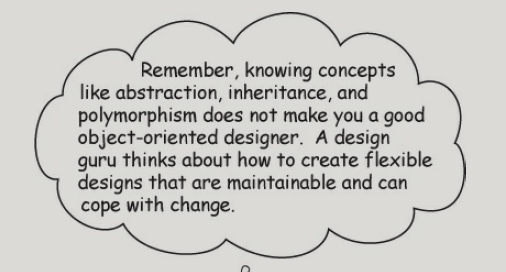
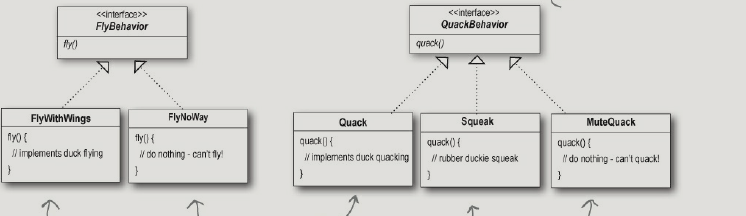
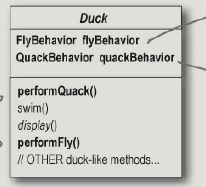
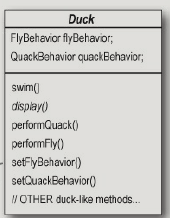
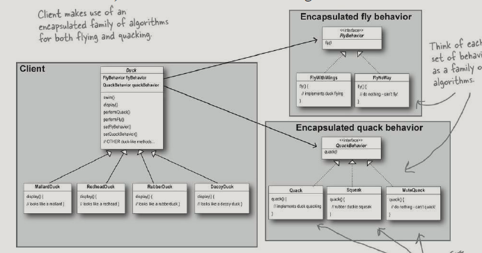
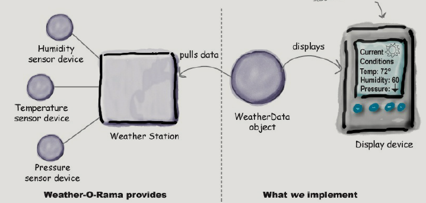
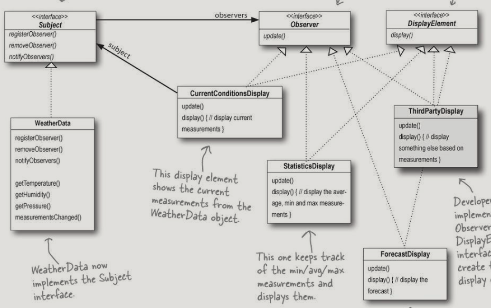
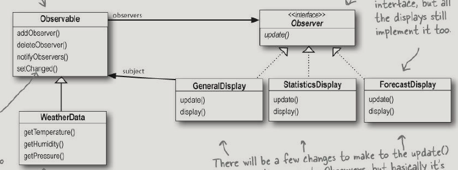

[TOC]

## Intro to Design Patterns: Welcome to Design Patterns
1.joe设计一个simulate duck class,
2.把所有的features方法都放在一个类里,电话说不是所有鸭子都有fly(),squack()
3.将fly，squack特性放在单独接口中 但是没有REUSE
4.动静分离 实现接口   
5.集成
6 set 
7 最终

**The one constant in software development**：change
**the basis for almost every design pattern**:
All patterns provide a way to let some part of a system vary independently of all other parts
**OO software DESIGN PRINCIPLE**

1. Identify the aspects of your application that vary and separate them from what stays the same.
2. Program to an interface, not an implementation
3. Favor composition over inheritance(HAS-A can be better than IS-A)
**The Strategy Pattern**
The Strategy Pattern defines a family of algorithms, encapsulates each one, and makes them interchangeable. Strategy lets the algorithm vary independently from clients that use it.

1 It started with a simple SimUDuck app

2 But now we need the ducks to FLY

3 But something went horribly wrong...

4 Joe thinks about inheritance...

5 How about an interface?

6 What would you do if you were Joe?

7 The one constant in software development

8 Zeroing in on the problem...

9 Separating what changes from what stays the same

10 Designing the Duck Behaviors

11 Implementing the Duck Behaviors

12 Integrating the Duck Behavior

13 More integration...

14 Testing the Duck code

15 Setting behavior dynamically

16 The Big Picture on encapsulated behaviors

17 HAS-A can be better than IS-A

18 Speaking of Design Patterns...

19 Overheard at the local diner...

20 Overheard in the next cubicle...

21 The power of a shared pattern vocabulary
**Shared vocabularies benefits**
Shared vocabularies can turbo-charge your development team. A team well versed in design patterns can move more quickly with less room for misunderstanding.
22 How do I use Design Patterns?
**one of the secrets to creating maintainable OO systems**
thinking about how they might change in the future
23 Tools for your Design Toolbox
BULLET POINTS P77

## The Observer Pattern: Keeping your Objects in the know

**the class diagram**

1 The Weather Monitoring application overview

2 Unpacking the WeatherData class

3 What do we know so far?

4 Taking a first, misguided SWAG at the Weather Station

5 What’s wrong with our implementation?

6 Meet the Observer Pattern

7 Publishers + Subscribers = Observer Pattern

8 A day in the life of the Observer Pattern

9 Five-minute drama: a subject for observation

10 Two weeks later...

11 The Observer Pattern defined
**The Observer Pattern**
The Observer Pattern defines a one-to-many dependency between objects so that when one object changes state, all of its dependents are notified and updated automatically

12 The Observer Pattern defined: the class diagram

13 The power of Loose Coupling

14 Cubicle conversation

15 Designing the Weather Station
**DESIGN PRINCIPLE**
1.Strive for loosely coupled designs between objects that interact

**Java’s built-in Observer Pattern**

****
[TOC]
****

**9 primary pattern**

- singleton pattern   chapter5

- factory pattern  chapter4 

- proxy pattern  chapter11

- strategy pattern  chapter1

- tempolate pattern  chapter8 

- observer pattern  chapter2

- adapter pattern  chapter7

- chain of responsibility pattern     p755

- builder pattern                        p752

3 6 9 10 12 13

index p775
TOC P851

notes：
想要最大效率并快速读完本书，你需要完全沉浸在书的内容中，不然效率大打折扣

