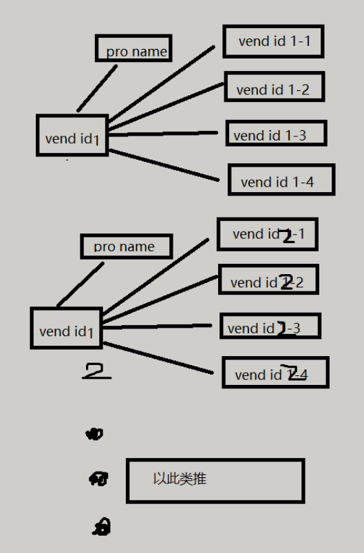

[TOC]

**MYSQL DBMS SQL relation and grammar?**
the reality is that no two DBMSs implement SQL identically. The SQL taught in this book is specific to MySQL, and while much of the language taught will be usable with other DBMSs, do not assume complete SQL syntax portability.

## Chapter 1.  Understanding SQL
A database might be a file stored on a hard drive, but it might not.
**why**?
Without a primary key, updating or deleting specific rows in a table becomes extremely difficult because there is no guaranteed safe way to refer to just the rows to be affected.
**Schema or Database?** Occasionally schema is used as a synonym for database (and schemata as a synonym for databases). While unfortunate, it is usually clear from the context which meaning of schema is intended. In this book, schema will refer to the definition given here.

**schema**
Tables have characteristics and properties that define how data is stored in them. These include information about what data may be stored, how it is broken up, how individual pieces of information are named, and much more. This set of information that describes a table is known as a schema, and schema are used to describe specific tables within a database, as well as entire databases (and the relationship between tables in them, if any).

****

1. Database Basics	
**why Table Name unique**
Table Names What makes a table name unique is actually a combination of several things, including the database name and table name.This means that while you cannot use the same table name twice in the same database, you definitely can reuse table names in different databases.

**Primary Key**
usually defines as one single column or many columns
**Always Define Primary Keys**
Although primary keys are not actually required, most database designers ensure that every table they create has a primary key so future data manipulation is possible and manageable
**Primary Key define conditions**
- No two rows can have the same primary key value.
- Every row must have a primary key value (primary key columns may not allow NULL values).

**Primary Key Best Practices**
- Don't update values in primary key columns.
- Don't reuse values in primary key columns.
- Don't use values that might change in primary key columns.
2. What Is SQL?
3. Try It Yourself 

## Chapter 2.  Introducing MySQL
1. What Is MySQL?
**MySQL criticism**
In fact, the only real technical criticism of MySQL is that it has not always supported the functionality and features offered by other DBMSs. But as new features are added to each new version, this is changing
**DBMSs two categories**
-  shared filebased: 
(which include products such as Microsoft Access and FileMaker) are designed for desktop use and are generally not intended for use on higher-end or more critical applications
-  client-server: 
MySQL, Oracle, and Microsoft SQL Server are client-serverbased databases

**client-server has two distinct parts**
- The server portion is a piece of software that is responsible for all data access and manipulation. This software runs on a computer called the database server.
- The client is the piece of software with which the user interacts.

2. MySQL Tools 
`mysql u ben` to specify a user login name of ben, you'd use . 
`mysql u ben p h myserver P 9999` To specify a username, host name, port, and be prompted for a password, you'd use.


## Chapter 3.  Working with MySQL   
1. Making the Connection   

>In the real world, however, the administrative login is closely protected (as access to it grants full rights to create tables, drop entire databases, change logins and passwords, and more).

**Using MySQL Administrator**The MySQL Administrator Users view provides a simple interface that can be used to define new users, including assigning passwords and access rights
2. Selecting a Database   

3. Learning About Databases and Tables   
`SHOW DATABASES`
`SHOW TABLES`
`(SHOW COLUMNS FROM)/DESCRIBE customers`show columns info from table

**auto increment def** MySQL can automatically assign the next available number for you each time a row is added to a table
## Chapter 4.  Retrieving Data  

Actual raw retrieved data (without application-provided formatting) is rarely displayed as is.
****
1. The SELECT Statement   
**select result displayed in a different order**
If query results are not explicitly sorted ,data will be returned in no order of any significance. It might be the order in which the data was added to the table, but it might not.


**NOTES**:
- **semicolons**: MySQL (like most DBMSs) does not require that a semicolon be specified after single statements,but If you are using the mysql command-line client, the semicolon is always needed
- **not case sensitive**
- **whitespace**:  is ignored when that statement is processed,Most SQL developers find that breaking up statements over multiple lines makes them easier to read and debug.


2. Retrieving Individual Columns   
`SELECT prod_name FROM products;`
3. Retrieving Multiple Columns   
`SELECT prod_id, prod_name, prod_price FROM products;`
4. Retrieving All Columns   
`SELECT * FROM products`
**Performance Caution : * **

retrieving unnecessary columns usually slows down the performance of your retrieval and your application.

5. Retrieving Distinct Rows   
`SELECT vend_id FROM products;`
`SELECT DISTINCT vend_id FROM products;` only return distinct values(The DISTINCT keyword applies to all columns, not just the one it precedes)
6. Limiting Results   
`SELECT prod_name FROM products LIMIT 5;`
`SELECT prod_name FROM products LIMIT 5,5;`The first number is where to start, and the second is the number of rows to retrieve
**caution**
Row 0 The first row retrieved is row 0, not row 1. As such, LIMIT 1,1 will retrieve the second row, not the first one.

7. Using Fully Qualified Table Names   
`SELECT products.prod_name FROM crashcourse.products;`

## Chapter 5.  Sorting Retrieved Data   
More often than not, the columns used in an ORDER BY clause are ones that were selected for display. However, this is actually not required, and it is perfectly legal to sort data by a column that is not retrieved.
****
1. Sorting Data   
**why should sort order**
>If unsorted, data is typically displayed in the order in which it appears in the underlying tables. This could be the order in which the data was added to the tables initially.
>However, if data was subsequently updated or deleted, the order is affected by how MySQL reuses reclaimed storage space.The end result is that you cannot (and should not) rely on the sort order if you do not explicitly control it.
>Relational database design theory states that the sequence of retrieved data cannot be assumed to have significance if ordering was not explicitly specified.
>`SELECT prod_name FROM products ORDER BY prod_name;`sort the data alphabetically by the prod_name column

2. Sorting by Multiple Columns   
`SELECT prod_id, prod_price, prod_name FROM products ORDER BY A, B;`display it sorted by A and B(first sort by A, and then within each A sort by B).

3. Specifying Sort Direction   
`SELECT prod_id, prod_price, prod_name FROM products ORDER BY prod_price DESC, prod_name;`The DESC(op: ASC) keyword only applies to the column name that directly precedes it.
**Case Sensitivity and Sort Orders**
is A the same as a? And does a come before B or after Z?
THIS depend on how the database is set up
In dictionary sort order, A is treated the same as a,However, administrators can change this behavior if needed.

## Chapter 6.  Filtering Data    
**SQL Versus Application Filtering** Data can also be filtered at the application level. To do this, the SQL SELECT statement retrieves more data than is actually required for the client application, and the client code loops through the returned data to extract just the needed rows.
As a rule, this practice is strongly discouraged. Databases are optimized to perform filtering quickly and efficiently. Making the client application (or development language) do the database's job dramatically impacts application performance and creates applications that cannot scale properly. In addition, if data is filtered at the client, the server has to send unneeded data across the network connections, resulting in a waste of network bandwidth resources
****
1. Using the WHERE Clause    
2. The WHERE Clause Operators    
**WHERE Clause Operators**

| Operator | Description                  |
| -------- | ---------------------------- |
| =        | Equality                     |
| <>       | Nonequality                  |
| !=       | Nonequality                  |
| <        | Less than                    |
| <=       | Less than or equal to        |
| >        | Greater than                 |
| >=       | Greater than or equal to     |
| BETWEEN  | Between two specified values |

**When to Use Quotes**
The single quotes are used to delimit strings.
`SELECT A, B FROM products WHERE prod_price BETWEEN 5 AND 10;`
including the specified range start and end values.
**NULL** No value, as opposed to a field containing 0, or an empty string, or just spaces.
**FIND NULL**
`SELECT prod_name FROM products WHERE prod_price IS NULL`
**Null note**
You might expect that when you filter to select all rows that do not have a particular value, rows with a NULL will be returned. But they will not.


## Chapter 7.  Advanced Data Filtering

**New Term**
 ***Operator*** A special keyword used to join or change clauses within a WHERE clause. Also known as logical operators.
have a higher order of evaluation than either AND or OR operators,
1. Combining WHERE Clauses    
`SELECT prod_name, prod_price FROM products WHERE (vend_id = 1002 OR vend_id = 1003) AND prod_price >= 10;`**Understanding Order of Evaluation**
- WHERE clauses can contain any number of AND and OR operators
- SQL (like most languages) processes AND operators before OR operators.
- parentheses
2. Using the IN Operator    
**The IN operator**
**IN**
IN A keyword used in a WHERE clause to specify a list of values to be matched using an OR comparison.
**pros**
The biggest advantage of IN is that the IN operator can contain another SELECT statement, enabling you to build highly dynamic WHERE clauses
3. Using the NOT Operator    
**NOT**
MySQL supports the use of NOT to negate IN, BETWEEN, and EXISTS clauses. This is quite different from most other DBMSs that allow NOT to be used to negate any conditions

## Chapter 8.  Using Wildcard Filtering

1. Using the LIKE Operator    
`SELECT prod_id, prod_name FROM products WHERE prod_name LIKE 'jet%'  /'s%e'  /%anvil%';`
**caution**
- It is important to note that, in addition to matching one or more characters, % also matches zero characters. % represents zero, one, or more characters at the specified location in the search pattern
- Not even the clause WHERE prod_name LIKE '%' will match a row with the value NULL as the product name.

`SELECT A, B FROM products WHERE prod_name LIKE '_ ton anvil';`
**The Underscore ( _ )  Wildcard**
The underscore is used just like %, but instead of matching multiple characters, the underscore matches just a single character.

2. Tips for Using Wildcards    
  **Wildcard(% and _ ) cons**  
  Wildcard searches typically take far longer to process than any other search types discussed previously
  **Performance Considerations**
  - Don't overuse wildcards. If another search operator will do, use it instead.
  - When you do use wildcards, try to not use them at the beginning of the search pattern unless absolutely necessary. Search patterns that begin with wildcards are the slowest to process.

## Chapter 9.  Searching Using Regular 
\\\ is also used to refer to metacharacters (characters that have specific meanings),
| Metacharacter | Description     |
| ------------- | --------------- |
| \\\f          | Form feed       |
| \\\n          | Line feed       |
| \\\r          | Carriage return |
| \\\t          | Tab             |
| \\\v          | Vertical tab    |
****
1. Expressions    
**MySQL regex**
MySQL only supports a small subset of what is supported in most regular expression implementations
2. Understanding Regular Expressions    
**use cases**

- '. ' is a special character in the regular expression language. It means match any single character
`SELECT prod_name FROM products WHERE prod_name REGEXP '.000'ORDER BY prod_name;`
- '|' To search for one of two strings (either one or the other), use | as seen here:
`SELECT prod_name FROM products WHERE prod_name REGEXP '1000|2000'ORDER BY prod_name;`
- '[]' But what if you wanted to match only specific characters? You can do this by specifying a set of characters enclosed within [ and ],
`SELECT prod_name FROM products WHERE prod_name REGEXP '[123] Ton'ORDER BY prod_name;`[123] defines a set of characters, and here it means match 1 or 2 or 3
- '^' To negate a character set, place a ^ at the start of the set.
`[^123] matches anything but those characters`
- '-'can be used to define a range `[0-9]` ranges need not be numeric, and so [a-z] will match any alphabetical character.
- '\\' To match special characters they must be preceded by \\. So, \\- means find and \\. means find .:
**LIKE and REGEXP diff**
`WHERE prod_name LIKE '1000'` find values but not return((unless wildcard characters were used).)
`WHERE prod_name REGEXP '1000'` find values and  return
**case sensitive** 
Regular expression matching in MySQL (as of version 3.23.4) are not case-sensitive (either case will be matched). To force case-sensitivity, you can use the BINARY keyword, as in
`WHERE prod_name REGEXP BINARY 'JetPack .000'`
3. Using MySQL Regular Expressions     
**Simple Regular Expression Testing**
`SELECT 'hello' REGEXP '[0-9]';`
You can use SELECT to test regular expressions without using database tables. REGEXP checks always return 0 (not a match) or 1 (match).
## Chapter 10.  Creating Calculated Fields
1. Understanding Calculated Fields    
2. Concatenating Fields
**concat() function**
The solution is to concatenate the two columns. In MySQL SELECT statements, you can concatenate columns using the Concat() function.
**MySQL Is Different**Most DBMSs use operators + or || for concatenation; MySQL uses the Concat() function. Keep this in mind when converting SQL statements to MySQL.
`SELECT Concat(vend_name, ' (', vend_country, ')')FROM vendors ORDER BY vend_name;`

**trim() function**
`SELECT Concat(RTrim(vend_name), ' (', RTrim(vend_country), ')')FROM vendors ORDER BY vend_name;`
The `RTrim() `function trims all spaces from the right of a value
MySQL supports the use of `LTrim() `(which trims the left side of a string), and `trim()` (which trims both the right and left).
**Using Aliases**
SELECT Concat(RTrim(vend_name), ' (', RTrim(vend_country), ')') AS vend_title FROM vendors ORDER BY vend_name;

3. Performing Mathematical Calculations    
**MySQL Mathematical Operators**
| Operator | Description    |
| -------- | -------------- |
| +        | Addition       |
| -        | Subtraction    |
| *        | Multiplication |
| /        | Division       |

 `SELECT prod_id,quantity,item_price,quantity*item_price AS expanded_price
FROM orderitems
WHERE order_num = 20005;`
**How to Test Calculations **

`SELECT 3 * 2`; would return 6, `SELECT Trim(' abc ');` would return abc, and`SELECT Now()` uses the Now() function to return the current date and time. 

## Chapter 11.  Using Data Manipulation Functions    

1. Understanding Functions    
**Functions Are Less Portable Than SQL**
Just about every major Database Management System (DBMS) supports functions that others don't, and sometimes the differences are significant
**use function note**
If you do decide to use functions, make sure you comment your code well, so that at a later date you (or another developer) will know exactly to which SQL implementation you were writing.
2. Using Functions    
**Most SQL implementations support types of functions**:
Text functions,Numeric functions,Date and time functions and System functions
`SELECT vend_name, UPPER(vend_name) AS vend_name_upcase FROM vendors ORDER BY vend_name;`
**Text Manipulation Functions**

| Function    | Description                             |
| ----------- | --------------------------------------- |
| Left()      | Returns characters from left of string  |
| Length()    | Returns the length of a string          |
| Locate()    | Finds a substring within a string       |
| Lower()     | Converts string to lowercase            |
| LTrim()     | Trims white space from left of string   |
| Right()     | Returns characters from right of string |
| RTrim()     | Trims white space from right of string  |
| Soundex()   | Returns a string's SOUNDEX value        |
| SubString() | Returns characters from within a string |
| Upper()     | Converts string to uppercase            |
**Soundex() def anduse case**
SOUNDEX is an algorithm that converts any string of text into an alphanumeric pattern describing the phonetic representation of that text. SOUNDEX takes into account similar sounding characters and syllables, enabling strings to be compared by how they sound rather than how they have been typed. Although SOUNDEX is not a SQL concept, MySQL (like many other DBMSs) offers SOUNDEX support.

Now try the same search using the Soundex() function to match all contact names that sound similar to Y. Lie:
`SELECT cust_name, cust_contact FROM customers WHERE Soundex(cust_contact) = Soundex('Y Lie');`

**Commonly Used Date and Time Manipulation Functions**

| Function    | Description                                            |
| ----------- | ------------------------------------------------------ |
| AddDate()   | Add to a date (days, weeks, and so on)                 |
| AddTime()   | Add to a time (hours, minutes, and so on)              |
| CurDate()   | Returns the current date                               |
| CurTime()   | Returns the current time                               |
| Date()      | Returns the date portion of a date time                |
| DateDiff()  | Calculates the difference between two dates Date_Add() |
| Day()       | Returns the day portion of a date                      |
| DayOfWeek() | Returns the day of week for a date                     |
| Hour()      | Returns the hour portion of a time                     |
| Minute()    | Returns the minute portion of a time                   |
| Month()     | Returns the month portion of a date                    |
| Now()       | Returns the current date and time                      |
| Second()    | Returns the second portion of a time                   |
| Time()      | Returns the time portion of a date time                |
| Year()      | Returns the year portion of a date                     |

**date format notes**
Filtering by date requires some extra care, and the use of special MySQL functions.
- The first thing to keep in mind is the date format used by MySQL.Whenever you specify a date, be it inserting or updating table values, or filtering using WHERE clauses, the date must be in the format yyyy-mm-dd.
- Always Use Four-Digit Years
`SELECT cust_id, order_num FROM orders WHERE order_date = '2005-09-01';`
**Date() function**
What if order dates were stored using the current date and time (so you'd not only know the order date but also the time of day that the order was placed)? Then WHERE order_date = '2005-09-01' fails if, for example, the stored order_date value is 2005-09-01 11:30:05.
`SELECT cust_id, order_num FROM orders WHERE Date(order_date) = '2005-09-01';`
**year() and month() function**
What if you wanted to retrieve all orders placed in September 2005? A simple equality test does not work as it matches the day of month, too
`SELECT cust_id, order_num FROM orders WHERE Date(order_date) BETWEEN '2005-09-01' AND '2005-09-30';`
another solution(one that won't require you to remember how many days are in each month, or worry about Feburary in leap years):
`SELECT cust_id, order_num FROM orders WHERE Year(order_date) = 2005 AND Month(order_date) = 9;`
**Numeric Manipulation Functions def**
Numeric manipulation functions do just thatmanipulate numeric data. These functions tend to be used primarily for algebraic, trigonometric, or geometric calculations
The ironic thing is that of all the functions found in the major DBMSs, the numeric functions are the ones that are most uniform and consistent

Commonly Used Numeric Manipulation Functions
| Function | Description                                            |
| -------- | ------------------------------------------------------ |
| Abs()    | Returns a number's absolute value                      |
| Cos()    | Returns the trigonometric cosine of a specified angle  |
| Exp()    | Returns the exponential value of a specific number     |
| Mod()    | Returns the remainder of a division operation          |
| Pi()     | Returns the value of pi                                |
| Rand()   | Returns a random number                                |
| Sin()    | Returns the trigonometric sine of a specified angle    |
| Sqrt()   | Returns the square root of a specified number          |
| Tan()    | Returns the trigonometric tangent of a specified angle |

## Chapter 12.  Summarizing Data    
1. Using Aggregate Functions    


**The Avg()  Function**

```
`SELECT AVG(prod_price) AS avg_price FROM products;`
```

**The Count()  Function**

- Use `COUNT(*)` to count the number of rows in a table, 
  whether columns contain values or `NULL` values.

  `SELECT COUNT(*) AS num_cust FROM customers;`

- Use `COUNT(column)` to count the number of rows that 
  have values in a specific column, ignoring `NULL` values.

  `SELECT COUNT(cust_email) AS num_cust FROM customers;`

**Using `MAX()` with Non-Numeric Data**

- Although `MAX()` is usually used to find the highest numeric or date values, MySQL allows it to be used to return the highest value in any column including textual columns. When used with textual data, `MAX()` returns the row that would be the last if the data were sorted by that column.
- `NULL` Values Column rows with `NULL` values in them are ignored by the `MAX()` function.

**The `SUM()` Function**

`SELECT SUM(item_price*quantity) AS total_price FROM orderitems WHERE order_num = 20005;`

2. Aggregates on Distinct Values    

  **DISTINCT NOTES**

   > DISTINCT may only be used with COUNT() if a column name is specified. DISTINCT may not be used with COUNT(*), and so COUNT(DISTINCT *) is not allowed and generates an error. Similarly, DISTINCT must be used with a column name and not with a calculation or expression.

   `SELECT AVG(DISTINCT prod_price) AS avg_price FROM products WHERE vend_id = 1003;`

3. Combining Aggregate Functions

   `SELECT COUNT(*) AS num_items, MIN(prod_price) AS price_min, MAX(prod_price) AS price_max, AVG(prod_price) AS price_avg FROM products;`

   **Naming Aliases** 

   When specifying alias names to contain the results of an aggregate function, try to not use the name of an actual column in the table.    


## Chapter 13.  Grouping Data    
1. Understanding Data Grouping    

2. Creating Groups    

   **Before you use GROUP BY, here are some important rules**

   - GROUP BY clauses can contain as many columns as you want. This enables you to nest groups, providing you with more granular control over how data is grouped.

   - If you have nested groups in your GROUP BY clause, data is summarized at the last specified group. In other words, all the columns specified are evaluated together when grouping is established (so you won't get data back for each individual column level).

   - Every column listed in GROUP BY must be a retrieved column or a valid expression (but not an aggregate function). If an expression is used in the SELECT, that same expression must be specified in GROUP BY. Aliases cannot be used.

   - Aside from the aggregate calculations statements, every column in your SELECT statement should be present in the GROUP BY clause.

   - If the grouping column contains a row with a NULL value, NULL will be returned as a group. If there are multiple rows with NULL values, they'll all be grouped together.

   - The GROUP BY clause must come after any WHERE clause and before any ORDER BY clause.

   **ROLLUP**

   Using ROLLUP To obtain values at each group and at a summary level (for each group), use the WITH ROLLUP keyword, as seen here

   `SELECT vend_id, COUNT(*) AS num_prods FROM products GROUP BY vend_id WITH ROLLUP;`

3. Filtering Groups  

   **having and where relation**

   MySQL provides yet another clause for this purpose: the HAVING clause. HAVING is very similar to WHERE. In fact, all types of WHERE clauses you learned about thus far can also be used with HAVING. The only difference is that WHERE filters rows and HAVING filters groups. 

   **HAVING Supports All of WHERE's Operators** 

   All the techniques and options you learned about WHERE can be applied to HAVING. The syntax is identical; just the keyword is different.

   `SELECT cust_id, COUNT(*) AS orders FROM orders GROUP BY cust_id HAVING COUNT(*) >= 2;`

   **The Difference Between HAVING and WHERE**

   WHERE filters before data is grouped, and HAVING filters after data is grouped.

4. Grouping and Sorting    

   **Don't Forget ORDER BY** As a rule, anytime you use a GROUP BY clause, you should also specify an ORDER BY clause. That is the only way to ensure that data is sorted properly. Never rely on GROUP BY to sort your data.

   `SELECT order_num, SUM(quantity*item_price) AS ordertotal FROM orderitems GROUP BY order_num HAVING SUM(quantity*item_price) >= 50ORDER BY ordertotal;`

5. SELECT Clause Ordering    

## Chapter 14.  Working with Subqueries    
1. Understanding Subqueries    

2. Filtering by Subquery    

   `SELECT cust_name, cust_contact FROM customers WHERE cust_id IN `

   `(SELECT cust_id FROM orders WHERE order_num IN (`

   `SELECT order_num FROM orderitems WHERE prod_id = 'TNT2'));`

   which can be replaced by `SELECT cust_name, cust_contact FROM customers, orders, orderitems WHERE customers.cust_id = orders.cust_id AND orderitems.order_num = orders.order_num AND prod_id = 'TNT2';`for performance

   Although usually used in conjunction with the IN operator, subqueries can also be used to test for equality (using =), non-equality (using <>), and so on.

3. Using Subqueries As Calculated Fields   

   **Correlated Subquery** :

   `SELECT cust_name, cust_state,(SELECT COUNT(*)FROM orders WHERE orders.cust_id = customers.cust_id) AS orders FROM customers ORDER BY cust_name;`

   That subquery is executed once for every customer retrieved

   **Subqueries Note**

   Subqueries  before `from` will be queried every time one row was retrieved,

   Subqueries  after  `from`will be queried only once 


## Chapter 15.  Joining Tables    
1. Understanding Joins    

   **Foreign Key** A column in one table that contains the primary key values from another table, thus defining the relationships between tables.

   `SELECT vend_name, prod_name, prod_price FROM vendors, products WHERE vendors.vend_id = products.vend_id ORDER BY vend_name, prod_name;`

2. Creating a Join (equijoins/Inner Join)   

   **Cartesian Product **The results returned by a table relationship without a join condition. The number of rows retrieved is the number of rows in the first table multiplied by the number of rows in the second table.

   **Don't Forget the WHERE Clause **Make sure all your joins have WHERE clauses, or MySQL returns far more data than you want. Similarly, make sure your WHERE clauses are correct. An incorrect filter condition causes MySQL to return incorrect data.

   `SELECT vend_name, prod_name, prod_price FROM vendors, products WHERE vendors.vend_id = products.vend_id;`

   is the same as :

   `SELECT vend_name, prod_name, prod_price FROM vendors INNER JOIN products ON vendors.vend_id = products.vend_id;`

   **Which Syntax to Use? **Per the ANSI SQL specification, use of the INNER JOIN syntax is preferable. Furthermore, although using the WHERE clause to define joins is indeed simpler, using explicit join syntax ensures that you will never forget the join condition, and it can affect performance, too (in some cases).

   **Joining Multiple Tables**

   SQL imposes no limit to the number of tables that may be joined in a SELECT statement.

   `SELECT prod_name, vend_name, prod_price, quantity FROM orderitems, products, vendors WHERE products.vend_id = vendors.vend_id AND orderitems.prod_id = products.prod_id AND order_num = 20005;`

   **Performance Considerations** 

   MySQL processes joins at run-time, relating each table as specified. This process can become very resource intensive, so be careful not to join tables unnecessarily. The more tables you join, the more performance degrades.

## Chapter 16.  Creating Advanced Joins    
1. Using Table Aliases    

   **Aiases Use Cases**

   In addition to using aliases for column names and calculated fields, SQL also enables you to alias table names

   **Where To Use Aiases**

   aliases are not limited to just WHERE. You can use aliases in the SELECT list, the ORDER BY clause, and in any other part of the statement as well.

2. Using Different Join Types   

   **Self Joins**:

   找到该prod_id下所有vend_id下的所有pro_name产品名称，前提是三个字段都在一张表

   `SELECT p1.prod_id, p1.prod_name FROM products AS p1, products AS p2 WHERE p1.vend_id = p2.vend_id   AND p2.prod_id = 'DTNTR';`

   **Self Joins Instead of Subqueries ** 

   sometimes these joins execute far more quickly than they do subqueries.

   **Natural Joins**

   A natural join is a join in which you select only columns that are unique. This is typically done using a wildcard (`SELECT *`) for one table and explicit subsets of the columns for all other tables

   `SELECT c.*, o.order_num, o.order_date, oi.prod_id, oi.quantity, oi.item_price FROM customers AS c, orders AS o, orderitems AS oi WHERE c.cust_id = o.cust_id   AND oi.order_num = o.order_num   AND prod_id = 'FB';`

   **Outer Joins**

   `SELECT customers.cust_id, orders.order_num FROM customers LEFT OUTER JOIN orders ON customers.cust_id = orders.cust_id;`

   unlike inner joins, which **relate rows in both tables**, **outer joins also include rows with no related rows.** When using OUTER JOIN syntax you **must **use the RIGHT or LEFT keywords to specify the table from which to include all rows (RIGHT for the one on the right of OUTER JOIN, and LEFT for the one on the left).

3. Using Joins with Aggregate Functions    

   `SELECT customers.cust_name, customers.cust_id, COUNT(orders.order_num)/count(*) AS num_ord FROM customers INNER JOIN orders ON customers.cust_id = orders.cust_id GROUP BY customers.cust_id;`

   `SELECT customers.cust_name, customers.cust_id, COUNT(orders.order_num) AS num_ord FROM customers LEFT OUTER JOIN orders ON customers.cust_id = orders.cust_id GROUP BY customers.cust_id;`

4. Using Joins and Join Conditions    

## Chapter 17.  Combining Queries 
1. Understanding Combined Queries   

2. Creating Combined Queries

   `SELECT vend_id, prod_id, prod_price FROM products WHERE prod_price <= 5`

   `UNION `

   `SELECT vend_id, prod_id, prod_price FROM products WHERE vend_id IN (1001,1002);` 

   same as :

   `SELECT vend_id, prod_id, prod_price FROM products WHERE prod_price <= 5OR vend_id IN (1001,1002);`

   the UNION might actually be more complicated than using a WHERE clause. But with more complex filtering conditions, or if the data is being retrieved from multiple tables (and not just a single table), the UNION could have made the process much simpler.   

   **UNION Rules**

   - A UNION must be comprised of two or more SELECT statements, each separated by the keyword UNION (so, if combining four SELECT statements, three UNION keywords would be used).

   - Each query in a UNION must contain the same columns, expressions, or aggregate functions (although columns need not be listed in the same order).

   - Column datatypes must be compatible: They need not be the exact same type, but they must be of a type that MySQL can implicitly convert (for example, different numeric types or different date types).

     

   **Including or Eliminating Duplicate Rows**

   The UNION automatically removes any duplicate rows from the query result set

   If you do, in fact, want all occurrences of all matches returned, you can use UNION ALL instead of UNION.

   Using UNION ALL, MySQL does not eliminate duplicates.

   **Sorting Combined Query Results**

   When combining queries with a UNION, only one ORDER BY clause may be used, and it must occur after the final SELECT statement. Even though the ORDER BY appears to only be a part of that last SELECT statement, MySQL will in fact use it to sort all the results returned by all the SELECT statements.

   **Combining Different Tables**

   However, everything you learned here also applies to using UNION to combine queries of different tables.

## Chapter 18.  Full-Text Searching    
1. Understanding Full-Text Searching    

   **Not All Engines Support Full-Text Searching**

   Not all engines support full-text searching as is described in this chapter. 

   The two most commonly used engines are MyISAM and InnoDB; the former supports full-text searching and the latter does not. 

   This is why, although most of the sample tables used in this book were created to use InnoDB, one (the productnotes table) was created to use MyISAM. If you need full-text searching functionality in your applications, keep this in mind.

   **Wildcard and regular expression limitations**

   - **Performance **Wildcard and regular expression matching usually requires that **MySQL try and match each and every row in a table (and table indexes are rarely of use in these searches). As such, these searches can be very time-consuming as the number of rows to be searched grows.**

   - **Explicit control** Using wildcard and regular expression matching, it is very difficult (and not always possible) to explicitly control what is and what is not matched. An example of **this is a search specifying a word that must be matched, a word that must not be matched, and a word that may or may not be matched but only if the first word is indeed matched**.

   - **Intelligent results **Although wildcard- and regular expressionbased searching provide for very flexible searching, neither provide an intelligent way to select results. For example, searching for a specific word would return all rows that contained that word, and **not distinguish between rows that contain a single match and those that contained multiple matches **(ranking them as potentially better matches). Similarly, searches for a specific word would not find rows that did not contain that word but did contain other related words.

   **full-text searching benefits**

   When full-text searching is used, MySQL does not need to look at each row individually, analyzing and processing each word individually. Rather, an index of the words (in specified columns) is created by MySQL, and searches can be made against those words. MySQL can thus quickly and efficiently determine which words match (which rows contain them), which don't, how often they match, and so on.

2. Using Full-Text Searching    

   <u>Enabling Full-Text Searching Support</u>
   

MySQL handles all indexing and re-indexing automatically after table columns have been appropriately designated.
   After indexing, `SELECT` can be used with `Match()` and `Against()` to actually perform the searches.

   **Input**

   `CREATE TABLE productnotes (   `

   `note_id    int           NOT NULL AUTO_INCREMENT,   `

   `prod_id    char(10)      NOT NULL,   `

   `note_date datetime       NOT NULL,   `

   `note_text  text          NULL ,   `

   `PRIMARY KEY(note_id),   `

   `FULLTEXT(note_text) `

   `) ENGINE=MyISAM;`

   **input analysis**

   One of those columns is named `note_text`, and it is indexed by MySQL for full-text searching as instructed by the clause `FULLTEXT(note_text)`. Here `FULLTEXT` indexes a single column, but multiple columns may be 
   specified if needed.

   Once defined, MySQL automatically maintains the index. When rows are added, updated, or deleted, the index is automatically updated accordingly.

   <u>Performing Full-Text Searches</u>

   **Input**

   1.``SELECT note_text FROM productnotes WHERE Match(note_text) Against('rabbit');`

   **input analysis**

   Match(note_text) instructs MySQL to perform the search against that named column, and Against('rabbit') specifies the word rabbit as the search text. As two rows contained the word rabbit, those two rows were returned.

   **Use Full Match()** Specification The value passed to `Match()` must be the same as the one used in the `FULLTEXT()` definition. If multiple columns are specified, all of them must be listed (and in the correct order).

   **Searches Are Not Case Sensitive** Full-text searches are not case sensitive, unless BINARY mode (not covered in this chapter) is used.

   2.`SELECT note_text FROM productnotes WHERE note_text LIKE '%rabbit%';`

   **1 compare to 2**,This SELECT retrieves the same two rows, but the order is different (although that may not always be the case).

   Both rows contained the word rabbit, but the row that contained the word rabbit as the third word ranked higher than the row that contained it as the twentieth word.An important part of full-text searching is the ranking of results. Rows with a higher rank are returned first

   **input**

   `SELECT note_text, Match(note_text) Against('rabbit') AS rank FROM productnotes;`

   **input analysis**

   Match() and Against() are used to create a calculated column (with the alias rank) which contains the ranking value calculated by the full-text search.The ranking is calculated by MySQL based on the number of words in the row, the number of unique words, the total number of words in the entire index, and the number of rows that contain the word.

   **Ranking Multiple Search Terms** If multiple search terms are specified, those that contain the most matching words will be ranked higher than those with less (or just a single match).

   <u>Using Query Expansion</u>

   **input**

   `SELECT note_text FROM productnotes WHERE Match(note_text) Against('anvils' WITH QUERY EXPANSION);`

   **input analysis**

   The second row has nothing to do with anvils, but as it contains two words that are also in the first row (customer and recommend) it was retrieved, too. The third row also contains those same two words, but they are further into the text and further apart, and so it was included, but ranked third. And this third row does indeed refer to anvils (by their product name).

   **The More Rows the Better** The more rows in your table (and the more text within those rows), the better the results returned when using query expansion.

   <u>Boolean Text Searches</u>

   **input**

   `SELECT note_text FROM productnotes WHERE Match(note_text) Against('heavy -rope*' IN BOOLEAN MODE);`

   **input analysis**

   the word heavy is matched, but this time rope* instructs MySQL to explicitly exclude any row that contains rope* (any word beginning with rope, including ropes, which is why one of the rows was excluded).

   

   **Input**
   `SELECT note_text FROM productnotes WHERE Match(note_text) Against('+rabbit +bait"' IN BOOLEAN MODE);`

   **Input Analysis**
   This search matches rows that contain both the words rabbit and bait.

   **Input**
   `SELECT note_text FROM productnotes WHERE Match(note_text) Against('rabbit bait' IN BOOLEAN MODE);`

   **Input Analysis**
   Without operators specified, this search matches rows that contain at least one of rabbit or bait.

    **Input**

   `SELECT note_text FROM productnotes
   WHERE Match(note_text) Against('"rabbit bait"' IN BOOLEAN MODE);`
   **Input Analysis**
   This search matches the phrase `rabbit bait` instead of 
   the two words `rabbit` and `bait`.
   **Input**

   `SELECT note_text FROM productnotes
   WHERE Match(note_text) Against('>rabbit <carrot' IN BOOLEAN MODE);`
   **Input Analysis**
   Match both `rabbit` and `carrot`, increasing the 
   rank of the former and decreasing the rank of the latter.
   **Input**

   `SELECT note_text FROM productnotes
   WHERE Match(note_text) Against('+safe +(<combination)' IN BOOLEAN MODE);`
   **Input Analysis**
   This search matches the words `safe` and 
   `combination`, lowering the ranking of the latter.
   **Note**
   Ranked, but Not Sorted In 
   boolean mode, rows will not be returned sorted descending by ranking score

   <u>Full-Text Search Usage Notes</u>

   - When indexing full-text data, short words are ignored and are 
     excluded from the index. Short words are defined as those having three or fewer 
     characters (this number can be changed if needed).
   
   - MySQL comes with a built-in list of stopwords, words that are always 
     ignored when indexing full-text data. This list can be overridden if needed. 
     (Refer to the MySQL documentation to learn how to accomplish this.)
   
   - Many words appear so frequently that searching on them would be 
     useless (too many results would be returned). As such, MySQL honors a 50% ruleif 
     a word appears in 50% or more rows, it is treated as a stopword and is 
     effectively ignored. (The 50% rule is not used for `IN BOOLEAN 
     MODE`).
   
   - Full-text searching never returns any results if there are 
     fewer than three rows in a table (because every word is always in at least 50% 
     of the rows).
   
   - Single quote characters in words are ignored. For example, 
     `don't` is indexed as `dont`.
   
   - Languages that don't have word delimiters (including Japanese 
     and Chinese) will not return full-text results properly.
   
   - As already noted, full-text searching is only supported in the 
     MyISAM database engine.

   **No Proximity Operators**

   Proximity operators are not yet supported by MySQL full-text searching, although this is planned for a future release.


## Chapter 19.  Inserting Data    

1. Understanding Data Insertion  

     **INSERT can be used in several ways:**

   - To insert a single complete row 

   - To insert a single partial row 

   - To insert multiple rows

   - To insert the results of a query

2. Inserting Complete Rows    

   `INSERT INTO Customers VALUES(NULL,'Pep E. LaPew','100 Main Street','Los Angeles','CA','90046','USA', NULL, NULL);`

   **insert notes**

   - when you insert ,**If a column has no value (for example, the cust_contact and cust_email columns), the NULL value should be used **(assuming the table allows no value to be specified for that column).
   - The first column, cust_id, is also NULL. This is because that column is automatically incremented by MySQL each time a row is inserted. You'd not want to specify a value (that is MySQL's job),

   `INSERT INTO customers(cust_name, cust_address, cust_city, cust_state, cust_zip, cust_country, cust_contact, cust_email)VALUES('Pep E. LaPew','100 Main Street','Los Angeles','CA','90046','USA', NULL, NULL);` is safer than above statement

   ****

   **Input Analysis**

   The advantage of this is that, even if the table layout or column order changes, the `INSERT` statement will still work correctly. You'll also notice that the `NULL` for `cust_id` was not needed, the `cust_id` column  was not listed in the column list and so no value was needed.

   **Omitting Columns** You may omit columns from an INSERT operation if the table definition so allows. One of the following conditions must exist:

   - primary key column.
   - The column is defined as allowing NULL values (no value at all).

   - A default value is specified in the table definition. This means the default value will be used if no value is specified.

   **alter default value**

   `alter table mytest alter column description set default 'he'`

   **Improving Overall Performance** Databases are frequently accessed by multiple clients, and it is MySQL's job to manage which requests are processed and in which order. **INSERT operations can be time consuming (especially if there are many indexes to be updated), and this can hurt the performance of SELECT statements that are waiting to be processed.**

   If data retrieval is of utmost importance (as is usually is), you can **instruct MySQL to lower the priority of your INSERT statement** by adding the keyword LOW_PRIORITY in between INSERT and INTO, like this:

   `INSERT LOW_PRIORITY INTO` Incidentally, this **also applies to the UPDATE and DELETE statements**

3. Inserting Multiple Rows    

4. Inserting Retrieved Data    

   `INSERT INTO customers(cust_id, cust_contact, cust_email, cust_name, cust_address, cust_city, cust_state, cust_zip, cust_country)``SELECT cust_id, cust_contact, cust_email, cust_name, cust_address, cust_city, cust_state, cust_zip, cust_country FROM custnew;`
## Chapter 20.  Updating and Deleting Data    
1. Updating Data    

    **Input**

   `UPDATE customers SET cust_email = 'elmer@fudd.com'WHERE cust_id = 10005;`

   **Input:Updating multiple columns**

   `UPDATE customers SET cust_name = 'The Fudds', cust_email = 'elmer@fudd.com'WHERE cust_id = 10005;`

   **The `IGNORE` Keyword** 
   If your `UPDATE` statement updates multiple rows and an error occurs while updating one or more of those rows, the entire `UPDATE` operation is cancelled (and any rows updated before the error occurred are restored to their original values). To continue processing updates, even if an error occurs, use the `IGNORE` keyword, like this:`UPDATE IGNORE customers ...`

2. Deleting Data   

    **Input**

   `DELETE FROM customers WHERE cust_id = 10006;`

   **Note**

   - If the `WHERE` clause were omitted, this statement would have deleted every customer in the table.
   - DELETE takes no column names or wildcard characters. DELETE deletes entire rows, not columns. To delete specific columns use an UPDATE statement

   **Faster Deletes** 

   If you really do want to delete all rows from a table, don't use DELETE.use the TRUNCATE TABLE statement

   TRUNCATE  is faster(actually drops and recreates the table, instead of deleting each row individually).

3. Guidelines for Updating and Deleting Data    

   - Use database enforced referential integrity (refer to Chapter 15 for this one, too) so **MySQL will not allow the deletion of rows that have data in other tables related to them.**

   - The bottom line is that MySQL has no Undo button. **Be very careful using UPDATE and DELETE**, or you'll find yourself updating and deleting the wrong data.


## Chapter 21.  Creating and Manipulating Tables    
1. Creating Tables    

   **Handling Existing Tables** 

   If you want to create a table only if it does not already exist, specify `IF NOT EXISTS` after the table name. This does not check to see that the schema of the existing table matches the one you are about to create. It simply checks to see if the table name exists, and only proceeds with table creation if it does not.

   **Understanding  `NULL`**

   ` `Don't confuse `NULL` values with empty strings. A  `NULL` value is the lack of a value; it is not an empty string. If you were to specify `''` (two single quotes with nothing in between them), that would be allowed in a `NOT NULL` column. An empty string is a valid value; it is not no value. `NULL` values are specified with the keyword 
   `NULL`, not with an empty string.

   **Primary Keys and `NULL` Values** 

   Only columns that do not allow `NULL` values can be used in primary keys. 
   Columns that allow no value at all cannot be used as unique identifiers.

   **Using `AUTO_INCREMENT`notes**

   Only one `AUTO_INCREMENT` column is allowed per table, and it must be 
   indexed (for example, by making it a primary key).

   **Overriding AUTO_INCREMENT** 

   You cansimply specify a value in the INSERT statement and as long as it is unique (has not been used yet), that value will be used instead of an automatically generated one. Subsequent incrementing will start using the value manually inserted.

   **Determining the `AUTO_INCREMENT` Value**

   By using the last_insert_id() function, like this:`SELECT last_insert_id();`

   This returns the last AUTO_INCREMENT value, which you can then use in subsequent MySQL statements.

   **Specifying Default Values**

   Functions Are Not Allowed Unlike most DBMSs, MySQL does not allow the use of functions as DEFAULT values; only constants are supported.

   **Engine Types** 

   Like every other DBMS, MySQL has an internal engine that actually manages and manipulates data. When you use the CREATE TABLE statement, that engine is used to actually create the tables, and when you use the SELECT statement or perform any other database processing, the engine is used internally to process your request. For the most part, the engine is buried within the DBMS and you need not pay much attention to it.

   But unlike every other DBMS, MySQL does not come with a single engine. Rather, it ships with several engines, all buried within the MySQL server, and all capable of executing commands such as CREATE TABLE and SELECT.they each have different capabilities and features, and being able to pick the right engine for the job gives you unprecedented power and flexibility.

   If you omit the ENGINE= statement, the default engine is used (most likely MyISAM), and most of your SQL statements will work as is. But not all of them will, and that is why this is important (and why two engines are used in the same tables used in this book).Here are several engines of which to be aware:

   - InnoDB is a transaction-safe engine (see Chapter 26, "Managing Transaction Processing"). It does not support full-text searching.

   - MEMORY is functionally equivalent to MyISAM, but as data is stored in memory (instead of on disk) it is extremely fast (and ideally suited for temporary tables).

   - MyISAM is a very high-performance engine. It supports full-text searching (see Chapter 18, "Full-Text Searching"), but does not support transactional processing.

   **Foreign Keys Can't Span** 

   That is, a table using one engine cannot have a foreign key referring to a table that uses another engine.

2. Updating Tables    

   **note**

   You should spend sufficient time anticipating future needs during the table design process so extensive changes are not required later on.

   **Input** :add column

   `ALTER TABLE vendors ADD vend_phone CHAR(20);`

   **Input** :remove column

   `ALTER TABLE Vendors DROP COLUMN vend_phone;`

   **Use `ALTER TABLE` Carefully** 

   Use `ALTER TABLE` with extreme caution, and be sure you have a complete set of backups (both schema and data) before proceeding. 

   **define the foreign keys** 

   `ALTER TABLE orderitems ADD CONSTRAINT fk_orderitems_orders FOREIGN KEY (order_num) REFERENCES orders (order_num);` 

   

   

3. Deleting Tables    

   **input**

   `DROP TABLE customers2;`

   **input analyze**

   Deleting tables (actually removing the entire table, not just the contents)

4. Renaming Tables    

   **rename one table**

   `RENAME TABLE customers2 TO customers;`

   **rename multiple table**

   `RENAME TABLE backup_customers TO customers, backup_vendors TO vendors, backup_products TO products;`

## Chapter 22.  Using Views    
1. Understanding Views    

   <u>Why Use Views</u>

   For the most part, after views are created, they can be used in the same way as tables. You can perform SELECT operations, filter and sort data, join views to other views or tables, and possibly even add and update data. (There are some restrictions on this last item. More on that in a moment.)

   **input**

   Now imagine that you could wrap that entire query in a virtual table called `productcustomers`

   `SELECT cust_name, cust_contact FROM productcustomers WHERE prod_id = 'TNT2';`

   The important thing to remember is views are just that, views into data stored elsewhere. Views contain no data themselves, so the data they return is retrieved from other tables.

   **Performance Issues** Because views contain no data, any retrieval needed to execute a query must be processed every time the view is used. If you create complex views with multiple joins and filters, or if you nest views, you may find that performance is dramatically degraded. Be sure you test execution before deploying applications that use views extensively.

   <u>View Rules and Restrictions</u> 

   - Like tables, views must be uniquely named. (They cannot be named with the name of any other table or view).

   - There is no limit to the number of views that can be created.

   - To create views, you must have security access. This is usually granted by the database administrator.

   - Views can be nested; that is, a view may be built using a query that retrieves data from another view.

   - ORDER BY may be used in a view, but it will be overridden if ORDER BY is also used in the SELECT that retrieves data from the view.

   - Views cannot be indexed, nor can they have triggers or default values associated with them.

   - Views can be used in conjunction with tables, for example, to create a SELECT statement which joins a table and a view

2. Using Views    

    **view creation:**

   - Views are created using the `CREATE VIEW` statement.

   - To view the statement used to create a view, use `SHOW CREATE VIEW` `viewname;`.

   - To remove a view, the `DROP` statement is used. The syntax is simply `DROP VIEW` `viewname;`.

   - To update a view you may use the `DROP` statement and then the `CREATE` statement again, or just use `CREATE OR REPLACE VIEW`, which will create it if it does not exist and replace it if it does.

   <u>Using Views to Simplify Complex Joins</u>

   `CREATE VIEW productcustomers AS SELECT cust_name, cust_contact, prod_id FROM customers, orders, orderitems WHERE customers.cust_id = orders.cust_id   AND orderitems.order_num = orders.order_num;`

   To retrieve a list of customers who ordered product `TNT2`, you can do the following:

   `SELECT cust_name, cust_contact FROM productcustomers WHERE prod_id = 'TNT2';`

   **<u>Tip</u>**
   **Creating Reusable Views** It is a good idea to create views that are not tied to 
   specific data. Expanding the scope of the view enables it to be reused, making it 
   even more useful. 

   <u>Using Views to Reformat Retrieved Data</u>

   **Note** 

   **WHERE Clauses and WHERE Clauses** 

   If a WHERE clause is used when retrieving data from the view, the two sets of clauses (the one in the view and the one passed to it) will be combined automatically

   <u>Updating Views</u>

   <u>Tip</u> 

   **Use Views for Retrieval** As a rule, use views for data retrieval (SELECT statements) and not for updates (INSERT, UPDATE, and DELETE).
## Chapter 23.  Working with Stored Procedures    
1. Understanding Stored Procedures 

      In other words, there are three primary benefitssimplicity, security, and performance. Obviously all are extremely important. Before you run off to turn all your SQL code into stored procedures, here's the downside:

   - Stored procedures tend to be more complex to write than basic SQL statements, and writing them requires a greater degree of skill and experience.

   - You might not have the security access needed to create stored procedures. Many database administrators restrict stored procedure creation rights, allowing users to execute them but not necessarily create them.

   Nonetheless, stored procedures are very useful and should be used whenever possible.

2. Why Use Stored Procedures    

   

3. Using Stored Procedures    

   <u>Executing Stored Procedures</u>
   MySQL refers to stored procedure execution as calling, and so the MySQL statement  to execute a stored procedure is simply `CALL`. `CALL` takes the name of the stored procedure and any parameters that need to be passed to it. Take a look at this example:
   **Input**

   `CALL productpricing(@pricelow,
   					 @pricehigh,
                      @priceaverage);`

   <u>Creating Stored Procedures</u>

   • Input

   `CREATE PROCEDURE productpricing()
   BEGIN
   	SELECT Avg(prod_price) AS priceaverage
   	FROM products;
   END;`

   **Analysis**

   The stored procedure is named productpricing and is thus defined with the statement CREATE PROCEDURE productpricing(). Had the stored procedure accepted parameters, these would have been enumerated between the ( and ). This stored procedure has no parameters, but the trailing () is still required. BEGIN and END statements are used to delimit the stored procedure body, and the body itself is just a simple SELECT statement

   **use this stored procedure? Like this:**

   • **Input**
   `CALL productpricing();`

   <u>Dropping Stored Procedures</u>

   **Input** 

   `DROP PROCEDURE productpricing;`

   **Analysis** 

   This removes the just-created stored procedure. Notice that **the trailing () is not used**; here just the stored procedure name is specified.

   **Tip** 

   **Drop Only If It Exists** 

   `DROP PROCEDURE` will throw an error if the named procedure does not actually exist. To delete a procedure if it exists (and not throw an error if it does not), use `DROP PROCEDURE IF EXISTS`.

   <u>Working with Parameters</u>

   **Input** 

   `CREATE PROCEDURE productpricing(`

   `OUT pl DECIMAL(8,2),` 

   `OUT ph DECIMAL(8,2),` 

   `OUT pa DECIMAL(8,2)`

   `)`

   `BEGIN` 

   `SELECT Min(prod_price)`

   `INTO pl` 

   `FROM products;`

   `SELECT Max(prod_price)`

   `INTO ph` 

   `FROM products;`

   `SELECT Avg(prod_price)`

   `INTO pa` 

   `FROM products;`

   `END;`

   **Analysis**
   This stored procedure accepts three parameters: Each parameter must have its type specified; here a decimal value is used. The keyword `OUT` is used to specify that this parameter is used to send a value out of the stored procedure (back to the caller). MySQL supports parameters of types `IN` (those passed to stored procedures), `OUT` (those passed from stored procedures, as we've used here), and `INOUT` (those used to pass parameters to and from stored procedures). The stored procedure code itself is enclosed within `BEGIN` and `END` statements as seen before, and a series of `SELECT` statements are performed to retrieve the values that are then saved into the appropriate variables (by specifying the `INTO` keyword).

   

   To call this updated stored procedure, three variable names must be specified, as seen here:

   **Input**

   `CALL productpricing(@pricelow,
                       @pricehigh,
                       @priceaverage);`

   **Analysis**
   These are the names of the three variables that the stored procedure will store the results in.

   **Note**
   **Variable Names All MySQL **
   variable names must begin with `@`.

   When called, this statement does not actually display any data. Rather, it returns variables that can then be displayed 

   To display the retrieved average product price you could do the following:
   • **Input**

   `SELECT @priceaverage;`

   To obtain all three values, you can use the following:
   • **Input**

   `SELECT @pricehigh, @pricelow, @priceaverage;`
   
   
   
   Here is another example, this time using both `IN` and `OUT` parameters. 
   
   **Input**`CREATE PROCEDURE ordertotal(
   IN onumber INT,
   OUT ototal DECIMAL(8,2)
   )
   BEGIN
   SELECT Sum(item_price*quantity)
   FROM orderitems
   WHERE order_num = onumber
   INTO ototal;
   END;`
   • Analysis
   `onumber` is defined as `IN` because the order number is passed in to the stored procedure. `ototal` is defined as `OUT` because the total is to be returned from the stored procedure. The `SELECT` statement used both of these parameters, the `WHERE` clause uses `onumber` to select the right rows, and `INTO` uses 
   `ototal` to store the calculated total.
   
   To invoke this new stored procedure you can use the following:
   • **Input**`CALL ordertotal(20005, @total);`
   
   To display the total you can then do the following:
   • **Input**`SELECT @total;`
   
   <u>Building Intelligent Stored Procedures</u>
   
   **Input**`-- Name: ordertotal
   -- Parameters: onumber = order number
   --             taxable = 0 if not taxable, 1 if taxable
   --             ototal = order total variable
   CREATE PROCEDURE ordertotal(
   IN onumber INT,
   IN taxable BOOLEAN,
   OUT ototal DECIMAL(8,2)
   ) COMMENT 'Obtain order total, optionally adding tax'
   BEGIN
   -- Declare variable for total
   DECLARE total DECIMAL(8,2);
   -- Declare tax percentage
   DECLARE taxrate INT DEFAULT 6;
   -- Get the order total
   SELECT Sum(item_price*quantity)
   FROM orderitems
   WHERE order_num = onumber
   INTO total;
   -- Is this taxable?
   IF taxable THEN
   -- Yes, so add taxrate to the total
   SELECT total+(total/100*taxrate) INTO total;
   END IF;
   -- And finally, save to out variable
   SELECT total INTO ototal;
   END;`
   
   **The `COMMENT` Keyword **
   The stored procedure for this example included a 
   `COMMENT` value in the `CREATE PROCEDURE` statement. This is not 
   required, but if specified, is displayed in `SHOW PROCEDURE STATUS` 
   results.
   
   **Input**
   
   `CALL ordertotal(20005, 0, @total);` 
   
   `SELECT @total;`
   
   <u>Inspecting Stored Procedures</u>
   
   **Input**`SHOW CREATE PROCEDURE ordertotal;`
   To obtain a list of stored procedures including details on when 
   and who created them, use `SHOW PROCEDURE STATUS`.
   
   **Limiting Procedure Status **
   Results `SHOW PROCEDURE STATUS` lists all  stored procedures. To restrict the output you can use `LIKE` to specify a filter pattern, for example:`SHOW PROCEDURE STATUS LIKE 'ordertotal';`
   
   

## Chapter 24.  Using Cursors    
1. Understanding Cursors    

   

2. Working with Cursors    

  **Using cursors involves several distinct steps:**
  **1.** Before a cursor can be used it must be declared (defined). This process does not actually retrieve any data; it merely defines the `SELECT` statement to be used.
  **2.** After it is declared, the cursor must be opened for use. This process actually retrieves the data using the previously defined `SELECT` statement.
  **3.** With the cursor populated with data, individual rows can be fetched (retrieved) as needed.
  **4.** When it is done, the cursor must be closed.
  
  
  
  <u>Opening and Closing Cursors</u>
  
  • **Input**
  `OPEN ordernumbers;`
  
  • **Analysis**
  When the OPEN statement is processed, the query is executed, and the retrieved data is stored for subsequent browsing and scrolling.
  
  • **Input**
  `CLOSE ordernumbers;`
  
  • **Analysis**
  CLOSE frees up any internal memory and resources used by the cursor, and so every cursor should be closed when it is no longer needed.After a cursor is closed, it cannot be reused without being opened again. However, a cursor does not need to be declared again to be used; an OPEN statement is sufficient.
  
  **Note** 
  
  **Implicit Closing** If you do not explicitly close a cursor, MySQL will close it automatically when the END statement is reached.
  
  <u>Using Cursor Data</u>
  
  **Input** 
  
  `CREATE PROCEDURE processorders()`
  
  `BEGIN`
  
  `-- Declare local variables` 
  
  `DECLARE done BOOLEAN DEFAULT 0;`
  `DECLARE o INT;`
  
  
  
  `-- Declare the cursor` 
  
  `DECLARE ordernumbers CURSOR FOR` 
  
  `SELECT order_num FROM orders;`
  
  
  
  `-- Declare continue handler` 
  
  `DECLARE CONTINUE HANDLER FOR SQLSTATE '02000' SET done=1;`
  
  `-- Open the cursor` 
  
  `OPEN ordernumbers;`
  
  `-- Loop through all rows` 
  
  `REPEAT`
  
  `-- Get order number` 
  
  ​	`FETCH ordernumbers INTO o;`
  
  `-- End of loop` 
  
  `UNTIL done END REPEAT;`
  
  `-- Close the cursor` 
  
  `CLOSE ordernumbers;`
  
  `END;`
  
  
  
  This statement defines a `CONTINUE HANDLER`, code that will be executed when a condition occurs. Here it specifies that when `SQLSTATE '02000'` occurs, then `SET done=1`. And `SQLSTATE '02000'` is a not found condition and so it occurs when `REPEAT` cannot continue because there are no more rows to loop through.
  
  **Note** 
  
  **MySQL Error Codes** For a complete list of MySQL error codes used by MySQL 5, see http://dev.mysql.com/doc/mysql/en/error-handling.html.
  
  **DECLARE Statement Sequence**
  
  Local variables defined with DECLARE must be defined before any cursors or handlers are defined, and handlers must be defined after any cursors. Failure to follow this sequencing will generate an error message.
  
  
  
  With this functionality in place you can now place any needed processing inside the loop (after the FETCH statement and before the end of the loop).
  
  **Input**
  
  `CREATE PROCEDURE processorders()`
  
  `BEGIN`
  
  `-- Declare local variables` 
  
  `DECLARE done BOOLEAN DEFAULT 0;`
  `DECLARE o INT;`
  `DECLARE t DECIMAL(8,2);`
  
  `-- Declare the cursor` 
  
  `DECLARE ordernumbers CURSOR FOR` 
  
  `SELECT order_num FROM orders;`
  `-- Declare continue handler` 
  
  `DECLARE CONTINUE HANDLER FOR SQLSTATE '02000' SET done=1;`
  
  `-- Create a table to store the results` 
  
  `CREATE TABLE IF NOT EXISTS ordertotals(order_num INT, total DECIMAL(8,2));`
  
  `-- Open the cursor` 
  
  `OPEN ordernumbers;`
  
  `-- Loop through all rows` 
  
  `REPEAT`
  
  `-- Get order number` 
  
  `FETCH ordernumbers INTO o;`
  
  `-- Get the total for this order` 
  
  `CALL ordertotal(o, 1, t);`
  
  `-- Insert order and total into ordertotals` 
  
  `INSERT INTO ordertotals(order_num, total)VALUES(o, t);`
  
  `-- End of loop` 
  
  `UNTIL done END REPEAT;`
  
  `-- Close the cursor` 
  
  `CLOSE ordernumbers;`
  
  `END;`
  
  **Input** `SELECT *FROM ordertotals;`


## Chapter 25.  Using Triggers    
1. Understanding Triggers    

   **Triggers Def**

    A trigger is a MySQL statement (or a group of statements enclosed within `BEGIN` and `END` statements) that are automatically executed by MySQL in response to any of these statements:

   - DELETE 

   - INSERT 

   - UPDATE 

   No other MySQL statements support triggers.

2. Creating Triggers    

   

     **Keep Trigger Names Unique per Database** In MySQL 5 trigger names must be unique per table, but not per database. This means that two tables in the same database can have triggers of the same name

   

   **Input: Triggers are created **

   `CREATE TRIGGER newproduct AFTER INSERT ON products
   FOR EACH ROW SELECT 'Product added';`

   **Notes**

   - **Only Tables** 

     Triggers are only supported on tables, not on views (and not on temporary tables).

   - Triggers are defined per time per event per table, and only one trigger per time per event per table is allowed. As such, up to six triggers are supported per table (before and after each of `INSERT`, `UPDATE`, and `DELETE`). A single trigger cannot be associated with multiple events or multiple tables, so if you need a trigger to be executed for both `INSERT` and `UPDATE` operations, you'll need to define two triggers.

   

3. Dropping Triggers    

     **Input** `DROP TRIGGER newproduct;`

   • **Analysis**
   Triggers cannot be updated or overwritten. To modify a trigger, it must be dropped and re-created.

4. Using Triggers    

   <u>INSERT TRiggers</u>

   **Be aware of the following:**

   - Within `INSERT` TRigger code, you can refer to a virtual 
     table named `NEW` to access the rows being inserted.

   - In a `BEFORE INSERT` trigger, the values in `NEW` 
     may also be updated (allowing you to change values about to be inserted).

   - For `AUTO_INCREMENT` columns, `NEW` will contain 
     `0` before and the new automatically generated value after.

   <u>DELETE triggers</u>

   **Be aware of the following**:

   - Within `DELETE` trigger code, you can refer to a virtual table named `OLD` to access the rows being deleted.

   - The values in `OLD` are all read-only and cannot be updated.

   **Input**

   `CREATE TRIGGER deleteorder BEFORE DELETE ON orders
   FOR EACH ROW
   BEGIN
   INSERT INTO archive_orders(order_num, order_date, cust_id)
   VALUES(OLD.order_num, OLD.order_date, OLD.cust_id);
   END;`

   **Analysis**

   - It used an `INSERT` statement to save the values in `OLD` (the order about to be deleted) into an archive table named `archive_orders`. (To actually use this example you'll need to create a table named 
     `archive_orders` with the same columns as `orders`).

   - The advantage of using a `BEFORE DELETE` TRigger (as opposed to an `AFTER DELETE` TRigger) is that if, for some reason, the order could not be archived, the `DELETE` itself will be aborted.

   <u>UPDATE triggers</u>
   **Be aware of the following**:

   - Within `UPDATE` trigger code, you can refer to a virtual table named `OLD` to access the previous (pre-`UPDATE` statement) values and `NEW` to access the new updated values.

   - In a `BEFORE UPDATE` trigger, the values in `NEW` may also be updated (allowing you to change values about to be used in the `UPDATE` statement).

   - The values in `OLD` are all read-only and cannot be updated.

   **Input**

   `CREATE TRIGGER updatevendor BEFORE UPDATE ON vendors
   FOR EACH ROW SET NEW.vend_state = Upper(NEW.vend_state);`
   • **Analysis**
   Obviously, any data cleanup needs to occur in the `BEFORE UPDATE` statement as it does in this example. Each time a row is updated, the value in `NEW.vend_state` (the value that will be used to update table rows) is replaced with `Upper(NEW.vend_state)`.

   **More on Triggers** 

   here are some important points to keep in mind when using triggers:

   - Trigger support in MySQL 5 is rather rudimentary at best when compared to other DBMSs. There are plans to improve and enhance trigger support in future versions of MySQL.

   - Creating triggers might require special security access. However, trigger execution is automatic. If an INSERT, UPDATE, or DELETE statement may be executed, any associated triggers will be executed, too.

   - Triggers should be used to ensure data consistency (case, formatting, and so on). The advantage of performing this type of processing in a trigger is that it always happens, and happens transparently, regardless of client application.

   - One very interesting use for triggers is in creating an audit trail. Using triggers it would be very easy to log changes (even before and after states if needed) to another table.

   - Unfortunately the CALL statement is not supported in MySQL triggers. This means that stored procedures cannot be invoked from within triggers. Any needed stored procedure code would need to be replicated within the trigger itself.

## Chapter 26.  Managing Transaction Processing    

**Changing the Default Commit Behavior**

`SET autocommit=0;`

• **Analysis**
The `autocommit` flag determines whether changes are committed automatically without requiring a manual `COMMIT` statement. Setting `autocommit` to 0 (false) instructs MySQL to not automatically commit changes (until the flag is set back to true).

**Note** **Flag Is Connection Specific** The autocommit flag is per connection, not server-wide.

****

1. Understanding Transaction Processing    

   **Transaction Def**

   Transaction processing is used to maintain database integrity by ensuring that batches of MySQL operations execute completely or not at all.

   

2. Controlling Transactions    

   **Input** `START TRANSACTION`

   <u>Using  ROLLBACK</u>

   • **Input**`SELECT * FROM ordertotals;
   START TRANSACTION;
   DELETE FROM ordertotals;
   SELECT * FROM ordertotals;
   ROLLBACK;
   SELECT * FROM ordertotals;`

   **Which Statements Can You Roll Back?** Transaction processing is used to manage `INSERT, UPDATE`, and `DELETE` statements. You cannot roll back `SELECT` statements. (There would not be much point in doing so anyway.) You cannot roll back `CREATE` or `DROP` operations. These statements may be used in a transaction block, but if you perform a rollback they will not be undone.

   <u>Using COMMIT</u>

   **Input** 

   `START TRANSACTION;`
   `DELETE FROM orderitems WHERE order_num = 20010;`
   `DELETE FROM orders WHERE order_num = 20010;`
   `COMMIT;`

   • **Analysis**
   a transaction block is used to ensure that the order is not partially deleted. The final COMMIT statement writes the change only if no error occurred. If the first DELETE worked, but the second failed, the DELETE would not be committed (it would effectively be automatically undone).

   **Using Savepoints**

   • **Input**  **create SAVEPOINT**   `SAVEPOINT delete1;`

   `ROLLBACK TO delete1;`

   **Releasing Savepoints** Savepoints are automatically released after a transaction completes (a ROLLBACK or COMMIT is issued). As of MySQL 5, savepoints can also be explicitly released using RELEASE SAVEPOINT.

   


## Chapter 27.  Globalization and Localization    
1. Understanding Character Sets and Collation Sequences    

   

2. Working with Character Set and Collation Sequences    

   **Input**
  
   `SHOW CHARACTER SET;`

  • **Analysis**
  This statement displays all available character sets, along with the description and default collation for each.

  To see the complete list of supported collations, use this statement:

  • **Input**
  `SHOW COLLATION;`

  • **Analysis**
  This statement displays all available collations, along with the character sets to which they apply.
## Chapter 28.  Managing Security    
1. Understanding Access Control    

    But in the real world you'd never use root on a day-to-day basis. Instead, you'd create a series of accounts, some for administration, some for users, some for developers, and so on.

   **Don't Use root** The root login should be considered sacred. Use it only when absolutely needed (perhaps if you cannot get in to other administrative accounts). root should never be used in day-to-day MySQL operations.

2. Managing Users    

    **obtain a list of all user accounts**

   • **Input obtain a list of all user accounts**
   `USE mysql;`
   `SELECT user FROM user;`

   **Analysis** The mysql database contains a table named user which contains all user accounts. user contains a column named user that contains the user login name.

   

   <u>Creating User Accounts</u>

   **Input Creating User Accounts** `CREATE USER ben IDENTIFIED BY 'p@$$w0rd';`

   • **Analysis**
   CREATE USER creates a new user account. A password need not be specified at user account creation time, but this example does specify a password

   **Specifying a Hashed Password** The password specified by `IDENTIFIED BY` is plain text that MySQL will encrypt before saving it in the `user` table. To specify the password as a hashed value, use `IDENTIFIED BY PASSWORD` instead.

   **Using GRANT or INSERT** The GRANT statement (which we will get to shortly) can also create user accounts, but generally CREATE USER is the cleanest and simplest syntax. In addition, it is possible to add users by inserting rows into user directly, but to be safe this is generally not recommended

   • **Input rename a user account**`RENAME USER ben TO bforta;`

   • **Input Deleting User Accounts**`DROP USER bforta;`

   

   <u>Setting Access Rights</u> 

   **user accounts created note**

   With user accounts created, you must next assign access rights and privileges. Newly created user accounts have no access at all. They can log into MySQL but will see no data and will be unable to perform any database operations.

   

   **Input show users rights** `SHOW GRANTS FOR bforta;`

   **Analysis** The output shows that user `bforta` has a single right granted, `USAGE ON *.*`. `USAGE` means no rights at all (not overly intuitive, I know), so the results mean no rights to anything on any database and any table.

   

   **Users Are Defined As user@host** MySQL privileges are defined using a combination of user name and hostname. If no host name is specified, a default hostname of % is used (effectively granting access to the user regardless of the hostname).

   

   **Input grant usages** `GRANT SELECT ON crashcourse.* TO beforta;`

   • Analysis
   This `GRANT` allows the use of `SELECT` on `crashcourse.*` (`crashcourse` database, all tables). By granting `SELECT` access only, user `bforta` has read-only access to all data in the crashcourse database.

   

   **Input revoke usages**`REVOKE SELECT ON crashcourse.* FROM beforta;`

   

   **GRANT and REVOKE can be used to control access at several levels:**

   - Entire server, using GRANT ALL and REVOKE ALL 

   - Entire database, using ON database.*

   - Specific tables, using ON database.table 

   - Specific columns 

   - Specific stored procedures

   **Rights and Privileges**

   

   

   

   **Granting for the Future** When using `GRANT` and `REVOKE`, the user account must exist, but the objects being referred to need not. This allows administrators to design and implement security before databases and tables are even created.

   A side effect of this is that if a database or table is removed (with a `DROP` statement) any associated access rights will still exist. And if the database or table is re-created in the future, those rights will apply to them.

   

   **Input Simplifying Multiple Grants** `GRANT SELECT, INSERT ON crashcourse.* TO beforta;`

   

   <u>Changing Passwords</u> 

   • **Input Changing Passwords** `SET PASSWORD FOR bforta = Password('n3w p@$$w0rd');`

   • **Input set your own password:**S`ET PASSWORD = Password('n3w p@$$w0rd');`


## Chapter 29.  Database Maintenance    
1. Backing Up Data    

   

2. Performing Database Maintenance    

   

3. Diagnosing Startup Problems    

    

4. Review Log Files    

## Chapter 30.  Improving Performance    
1. Improving Performance

   Poorly performing databases (and database queries, for that matter) tend to be the most frequent culprits when diagnosing application sluggishness and performance problems.

So, here goes:

- First and foremost, MySQL (like all DBMSs) has specific hardware recommendations. Using any old computer as a database server is fine when learning and playing with MySQL. But production servers should adhere to all recommendations.

- As a rule, critical production DBMSs should run on their own dedicated servers.

- MySQL is preconfigured with a series of default settings that are usually a good place to start. But after a while you might need to tweak memory allocation, buffer sizes, and more. (To see the current settings use SHOW VARIABLES; and SHOW STATUS;.)
- MySQL is a multi-user multi-threaded DBMS; in other words, it often performs multiple tasks at the same time. And if one of those tasks is executing slowly, all requests will suffer. If you are experiencing unusually poor performance, use SHOW PROCESSLIST to display all active processes (along with their thread IDs and execution time). You can also use the KILL command to terminate a specific process (you'll need to be logged in as an administrator to use that one).

- There is almost always more than one way to write a SELECT statement. Experiment with joins, unions, subqueries, and more to find what is optimum for you and your data.

- Use the EXPLAIN statement to have MySQL explain how it will execute a SELECT statement.

- As a general rule, stored procedures execute quicker than individual MySQL statements.

- Use the right data types, always.

- Never retrieve more data than you need. In other words, no SELECT * (unless you truly do need each and every column).

- Some operations (including INSERT) support an optional DELAYED keyword that, if used, returns control to the calling application immediately and actually performs the operation as soon as possible.

- When importing data, turn off autocommit. You may also want to drop indexes (including FULLTEXT indexes) and then re-create them after the import has completed.

- Database tables must be indexed to improve the performance of data retrieval. Determining what to index is not a trivial task, and involves analyzing used SELECT statements to find recurring WHERE and ORDER BY clauses. If a simple WHERE clause is taking too long to return results, you can bet that the column (or columns) being used is a good candidate for indexing.

- Have a series of complex OR conditions in your SELECT statement? You might see a significant performance improvement by using multiple SELECT statements and UNION statements to connect them.

- Indexes improve the performance of data retrieval, but hurt the performance of data insertion, deletion, and updating. If you have tables that collect data and are not often searched, don't index them until needed. (Indexes can be added and dropped as needed).

- LIKE is slow. As a general rule, you are better off using FULLTEXT rather than LIKE.

- Databases are living entities. A well-optimized set of tables might not be so after a while. As table usage and contents change, so might the ideal optimization and configuration.

- And the most important rule is simply thisevery rule is meant to be broken at some point.

## terminology

a calculated field 
SQL implementation
alphanumeric
aggregate functions
algebraic, trigonometric, or geometric calculations
Standard Deviation

[TOC]


****
**unhandle**:
chapter 9 regex grammar and Chapter 18.  Full-Text Searching没有完全掌握

**notes**:

1. **order**:

  select>from>where>group by>having>order by>limit

2. **Performance Considerations Summary**:

  **It Pays to Experiment **As you can see, there is often more than one way to perform any given SQL operation. And there is rarely a definitive right or wrong way. **Performance can be affected by the type of operation, the amount of data in the tables, whether indexes and keys are present, and a whole slew of other criteria**. Therefore, it is often worth experimenting with different selection mechanisms to find the one that works best for you.

  - Don't overuse wildcards. If another search operator will do, use it instead.
  - When you do use wildcards, try to not use them at the beginning of the search pattern unless absolutely necessary. Search patterns that begin with wildcards are the slowest to process.
  - be careful not to join tables unnecessarily. The more tables you join, the more performance degrades.

3. **statements notes**:

   

   - **Self Joins**:

     找到该prod_id下所有vend_id下的所有pro_name产品名称，前提是三个字段都在一张表

     `SELECT p1.prod_id, p1.prod_name FROM products AS p1, products AS p2 WHERE p1.vend_id = p2.vend_id   AND p2.prod_id = 'DTNTR';`

     语句逻辑图：

     

     像这种 联合 查询同一个表,`vend_id`不是主键（是主键直接是行数平方）情况下：

     `SELECT p1.column1, p1.column2 FROM Table1 AS p1, Table1 AS p2 `

     `WHERE p1.vend_id = p2.vend_id`

     行数是每一种`vend_id`相同数量的平方之和

     
